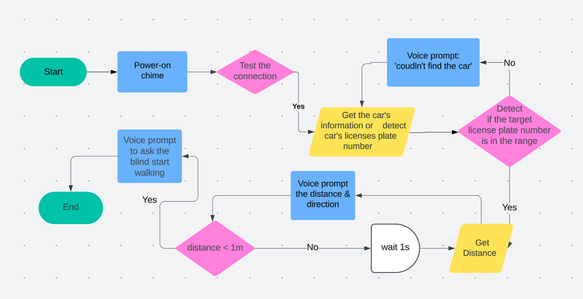

# VisionRide: A Deep Learning Workflow-Based Ride-Hailing Assistance Agent for the Visually Impaired

## Introduction

This project is designed to assist blind individuals in safely locating their target vehicle by recognizing the license plate and estimating the distance and direction to the car. The device provides real-time voice guidance and is built on lightweight, wearable hardware.

## Features

**Client-Server Architecture:** The deep learning inference tasks are handled by the server, while the client only requires the capability to capture images and play audio.

**License Plate Detection:** Detect license plates from camera input.

**Monocular Depth Estimation:** Estimates the distance between the user and the target car using a deep learning metric depth estimation model.

**Voice Feedback:** Gives verbal instructions including detected plate number, direction, and proximity.

The flow below illustrates the real-time decision-making process of the device:



## Environment

**Hardware Environment**

- **Server:** GPU with 16GB VRAM
- **Client:** Raspberry Pi, Camera, and Bluetooth Headset

**Software Environment**

- **Server:** Ubuntu 22.04 & CUDA 11.7+
- **Client:** Python 3.6+

## Installation

### Server

Install `xtts-api-server`

> https://github.com/daswer123/xtts-api-server

Install `OpenALPR`

> https://github.com/openalpr/openalpr

Install `ollama`

> https://ollama.com/

Download LLM: `Phi-4` (Replaceable)

```
ollama run phi4
```

Download the checkpoint for the Depth Anything metric depth estimation model and place it in the `./checkpoints` folder.

> https://huggingface.co/spaces/LiheYoung/Depth-Anything/tree/main/checkpoints_metric_depth

Create a new Conda environment from the configuration file.

```
conda env create -f env.yml
```

Modify the configuration items in `const.py`, primarily focusing on the following content:

```python
# XTTS Service URL
XTTS_URL = "http://127.0.0.1:8003/tts_to_audio"

# Absolute path of speaker file
SPEAKER_WAV_PATH = "/home/ubuntu/re_wav/en_re_man.wav"
```

**Note:** When running the server, an error may occur indicating that torchhub cannot be found. In this case, place the torchhub folder in the user's root directory.

```
mv ./torchhub ~/torchhub
```

### Client

```
pip install -r requirements.txt
```

Modify the configuration items in `config.py`, primarily focusing on the following content, ensuring consistency with the server.

```python
# Server Host Address
HOST = '127.0.0.1'

# Server port
PORT = 8002
```

## Usage

### Server

Start the `xtts-api-server`. In the installation folder of `xtts-api-server`, run the following command:

```
python -m xtts_api_server --deepspeed -p 8003 --listen
```

Start the server program:

```
conda activate VisionRide
nohup python -u server.py >> server.log 2>&1 &
```

### Client

Start the client program:

```
python client.py
```
